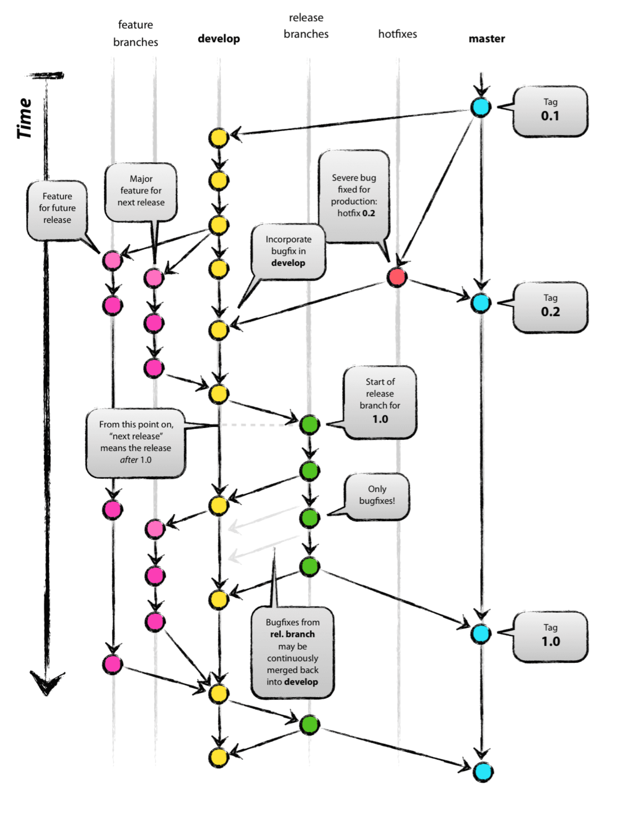

# DevOps CICD Cycle

This is a short walk through on how a typical CICD Cycle for a Dassault Infra Change could look like.

## Introduction

- The CC/C3 Bitbucket git Repo originates in the same Business Code Repo as C2
  - meaning that CC/C3 Bitbucket git repo is a `git clone` of the C2 Bitbucket git Repo
- Jenkins will create a Pipeline for **_every(!)_** branch in the business code Repo
  - meaning that **_both(!)_** Jenkins instances in C2 and CC/C3 will create pipelines for **_all_** branches it detects in the git Repo
  - the Jenkins Pipeline that will be created conforms to the version of the `Jenkinsfile` as it is in its associated branch
  - CC/C3 Jenkins will make sure that conditional pipeline steps that might exist in the pipeline execute the `if env = "prod"` steps and vice versa the C2 Jenkins makes sure that for such conditional pipeline steps the `if env = "test"` steps
  
## Business Code Git Repo Flow

- https://nvie.com/posts/a-successful-git-branching-model/
- https://gist.github.com/JamesMGreene/cdd0ac49f90c987e45ac

Let's start with assuming there the team decided to work with four branches:

- feature/XXX</br>
  Developers develop any change on feature branches
  - `git flow  feature start MYFEATURE`</br>
    or
  - `git checkout  feature/MYFEATURE` 

Feature Branches will be excluded in Jenkins, meaning no Pipeline will be created and run for any feature branch.

After doing (probably) multiple commits to the feature branch and running ansible and from these manually and the feature seems to work, the Developer merges his feature branch back into `develop` branch.

- develop</br>
  merge a feature branch into develoop branch
  - `git flow feature finish MYFEATURE`</br>
    or
  - `git checkout develop`
  - `git merge --no-ff feature/MYFEATURE`
  - `git branch -d feature/MYFEATURE`

By doing so and pushing to Bitbucket, the push kicks of C2 Jenkins Pipelines, updates the Pipeline to the state the `Jenkinsfile` has in `develop` branch and executes it. This eventually will kick of one or more Job in AWX Ansible, execute and update the Deployment and hopefully also executes Tests on C2 Infra, if everything of the implemented (merged) Feature works.

If not, the developer will further commit on his Feature branch and finally again merging to `develop` branch.

If `develop` CICD Cycle ran including tests ran sucessfully, the developer wants to change `production` accordingly.

Therefore he merges the `develop` branch into the `prod` branch:

- prod<br>
  merge the commits from `develop` branch to `prod` branch
  - `git checkout prod`
  - `git merge --no-ff develop`

This will kick of CC Jenkins Pipelines, updates the Pipeline to the state the `Jenkinsfile` has in `prod` branch and executes it, eventually Deploying all changes to production.

## CICD Configuration

The Pipeline (`Jenkinsfile`) as well as the Deploy (e.g. ansible AWX) should be as much the same for each environment (test, prod) as possible, as we want the test deploy run in C2 should essentially do "the same" as it should in CC/C3. Otherwise the test steps of the pipeline in C2 would be of limited use.

But as Configurations like

- which VLANs
- which Servers
- which Storrage
- ...

will be different in Test and prod, and also will have different levels of security levels to obey, such Configuration Data will be kept in their own Bitbucket Git Repos in C2 (for test) and CC/C3 (for prod).

Configuration/State Git Repos should follow the same "structure" folder names and structure as well as filenames, but contain different configuration data, e.g. both Config repos (C2 and CC/C3) contain a file `./networks/VLANs.yml`,

but in C2 Configuration/State Repo it has contents:

```yaml
vlanTest1 active
vlanTest1 active
```

but in CC/C2 Configuration/STate Repo:

```yaml
vlanProd1 active
vlanProd2 active
vlanProd3 active
vlanProd4 standby
```

Jenkins (via Jenkinsfile) as well as AWX ansible Deploy do checkout "their" associated Config repo (C2 respectively CC/C3) and act upon *their* configuration items.

Following Picture shows a standard Development Cycle according to the "git flow" standard:

